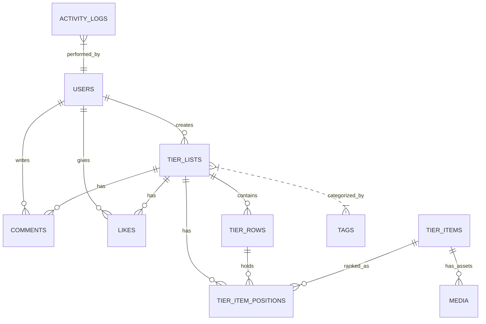

# 🛠️ TierForge — Modern Tier Maker SaaS


**TierForge** is a production-grade, enterprise-ready SaaS platform designed for creating, sharing, and collaborating on Tier Lists. Built with the latest Laravel 13 ecosystem, it focuses on high performance, real-time interactivity, and scalable architecture.

---

## 🌟 Step 0: Product Overview & Vision

### 1. What is TierForge?
TierForge is more than just a "Tier Maker." It is a community-driven ranking engine. It allows users to create templates, rank items via drag-and-drop, and engage in real-time collaborative ranking sessions.

### 2. What problem does it solve?
Most existing tier list tools are:
- **Static**: No real-time updates or collaborative ranking.
- **Slow**: Poor performance when handling hundreds of items.
- **Limited**: Lack of advanced search, moderation, and community features.
- **Ad-heavy**: Poor user experience due to intrusive advertising.

TierForge solves this by providing a high-speed, interactive interface with robust community features and a modern tech stack.

### 3. Target Users
- **Content Creators**: Streamers and YouTubers who want to rank games/movies with their audience.
- **Communities**: Gaming and hobbyist groups who want to build "definitive" rankings.
- **Data Analysts**: Users looking for structured community sentiment on various topics.

### 4. Real-World Use Cases
- **Community Consensus**: Real-time voting on the "Best RPGs of 2024."
- **Live Streams**: Streamers sharing a link for viewers to see updates live via WebSockets.
- **Product Reviews**: Tech reviewers ranking hardware components.

### 5. SaaS Opportunities
- **Premium Templates**: High-resolution, exclusive assets.
- **Private Workspaces**: For teams/studios to rank internal projects.
- **API Access**: For 3rd party integrations to fetch community rankings.

---

## 🚀 Tech Stack Rationale

| Technology | Rationale |
| :--- | :--- |
| **Laravel 13** | The most advanced PHP framework, offering unparalleled developer productivity and enterprise features. |
| **PHP 8.4+** | Leveraging Property Hooks, JIT, and strict typing for maximum performance. |
| **PostgreSQL** | Robust relational data handling with native support for JSONB and advanced indexing. |
| **Redis** | Essential for high-speed caching and managing background jobs via Horizon. |
| **Filament 5** | Provides a stunning, high-performance TALL-stack admin panel and CRUD interface. |
| **Laravel Reverb** | First-party high-performance WebSocket server for real-time collaboration. |
| **Meilisearch** | Lightning-fast, typo-tolerant search for templates and rankings. |
| **Docker** | Ensures "it works on my machine" consistency across development and production. |

---

## 🏗️ Architecture Explanation

TierForge follows **Clean Architecture** and **SOLID** principles to ensure the codebase remains maintainable as it scales.

### 1. Folder Structure
- `app/Actions`: Single-responsibility classes for business logic (e.g., `CreateTierListAction`).
- `app/DTOs`: Data Transfer Objects to ensure type safety between layers.
- `app/Repositories`: Abstraction layer for database queries to keep models slim.
- `app/Services`: Coordination layer for complex operations involving multiple actions or repositories.
- `app/Contracts`: Interfaces to ensure decoupled dependencies.
- `app/ValueObjects`: Immutable objects representing domain concepts (e.g., `ColorHex`).

### 2. Request Lifecycle
1. **Route** -> **Form Request** (Validation) -> **Controller** (Thin).
2. **Controller** -> **DTO** (Data Mapping) -> **Service/Action**.
3. **Action** -> **Repository** (Persistence) -> **Event** (Async processing).
4. **Queue** (Horizon) -> **Search Index** (Meilisearch) / **Notifications**.

---

## 🛠️ Step 1: Initialization & Infrastructure

### Local Setup Guide (Docker)

**Prerequisites:**
- Docker & Docker Compose
- Node.js & NPM (for local asset compilation if needed)

**Step-by-Step Installation:**

1. **Clone & Environment Setup:**
   ```bash
   git clone <repo-url> tierforge
   cd tierforge
   cp .env.example .env
   ```

2. **Spin up Infrastructure:**
   ```bash
   docker-compose up -d --build
   ```

3. **Initialize Application:**
   ```bash
   docker-compose exec app composer install
   docker-compose exec app php artisan key:generate
   docker-compose exec app php artisan migrate --seed
   docker-compose exec app php artisan horizon:install
   docker-compose exec app php artisan filament:install
   ```

4. **Compile Assets:**
   ```bash
   npm install
   npm run dev
   ```

---

## 📊 Step 2: Database Architecture

### Entity Relationship Diagram (ERD)



### PostgreSQL Optimization Strategy

#### 1. UUID Primary Keys
Every table uses `UUID v7` (via Laravel's `HasUuids`) to ensure:
- **Scalability**: No single-point-of-failure for ID generation.
- **Security**: Prevents ID enumeration attacks on public resources.
- **Distributed Ready**: Seamless merging of data across different databases/shards.

#### 2. Specialized Indexing
- **Composite Indexes**: Used on `tier_item_positions` (`tier_list_id`, `tier_row_id`, `position`) to optimize the retrieval of ranked items.
- **Unique Constraints**: `likes` table uses a unique composite key `(user_id, likeable_id, likeable_type)` to ensure data integrity at the database level.
- **JSONB Indexing**: GIN indexes will be added as metadata schemas solidify for high-speed attribute filtering.

#### 3. Soft Deletes & Audit Trails
- **Soft Deletes**: Implemented on `users`, `tier_lists`, and `comments` for historical integrity.
- **Activity Logs**: Dedicated table with JSONB properties to track changes for moderation and security auditing.

#### 4. Partitioning Strategy (Future)
For high-scale growth, we have designed the schema to support:
- **Range Partitioning**: On `activity_logs` by `created_at` (e.g., monthly partitions).
- **Hash Partitioning**: On `likes` and `comments` by `tier_list_id` to distribute social data across shards.

### Database Integrity Tests
Run the following to verify the schema and relationships:
```bash
docker-compose exec app php artisan test tests/Feature/Database/SchemaTest.php
```

---

### Command Reference

| Command | Purpose |
| :--- | :--- |
| `php artisan horizon` | Monitor background queues. |
| `php artisan reverb:start` | Start the WebSocket server. |
| `php artisan scout:import` | Sync data to Meilisearch. |
| `php artisan make:filament-user` | Create a new administrative user. |
| `php artisan reverb:start --debug` | Start the WebSocket server with debugging. |
| `composer test` | Run Pest PHP tests. |
| `composer pint` | Fix code style issues. |
| `composer analyze` | Run Larastan static analysis. |

---

## 🔒 Security & Performance

- **Security**: Strict Policy-based authorization, UUIDs for all public resources, and encrypted communication.
- **Performance**: N+1 prevention via Eager Loading, Redis-backed sessions/cache, and optimized PostgreSQL indexes.
- **Scaling**: Horizontally scalable via Docker, stateless application design, and distributed queue processing.

---

## 🤝 Debugging & Support

- Check logs: `storage/logs/laravel.log` or `docker-compose logs -f app`.
- Horizon Dashboard: `http://localhost/horizon`.
- Reverb Debugging: Use `php artisan reverb:start --debug`.

---

<p align="center">
Built with ❤️ by me Divesh.
</p>
